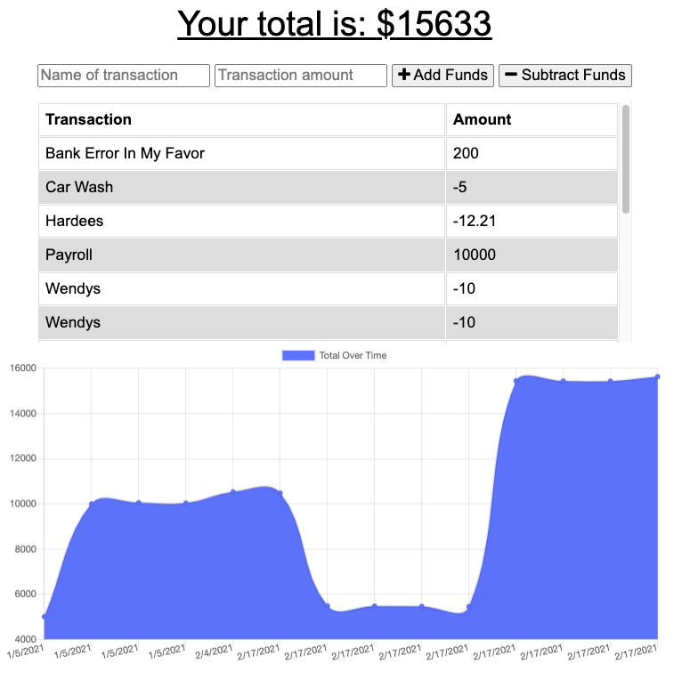

# **Budget Tracker**

## Description 
For anyone who is an avid traveler this ap allows you to be able to track your withdrawals and deposits with or without a data/internet connection.  This ensures that your account balance is accurate when traveling.
## Screenshots

## Table of contents
- [Description](#Description)
- [License](#License)
- [Repository Link](#Repository)
- [Diployed App Info](#App) 
- [GitHub Info](#GitHub) 
## License
MIT
## Repository
- [Budget Tracker](https://github.com/Meddle74/pwa-Budget-Tracker)

## App
- [Budget Tracker App on Heroku](https://traveling-budget-app.herokuapp.com/)
## GitHub
- Email: jpatricklloyd@gmail.com
- [GitHub Profile](https://github.com/Meddle74)